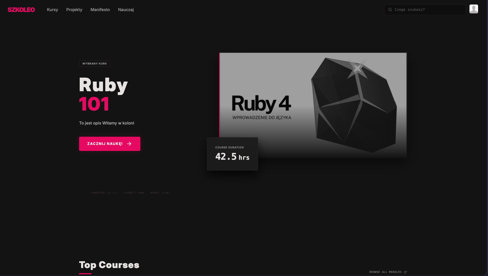

# Szkoleo - Modern eLearning webapp built with Ruby



## Setup

The easiest way to run the project locally is with Docker Compose — it spins up the Rails app, PostgreSQL, DragonflyDB (Redis-compatible cache), MinIO (S3-compatible storage), and Mailcatcher all at once.

**Prerequisites:** Docker & Docker Compose installed.

### 1. Clone the repository

```bash
git clone https://github.com/PatRogala/elearning.git
cd elearning
```

### 2. Start all services

```bash
docker compose up --build
```

This builds the dev image (Ruby 4, Bun, PostgreSQL client) and starts:

| Service | URL |
|---|---|
| Rails app | http://localhost:3000 |
| MinIO console | http://localhost:9001 |
| Mailcatcher web UI | http://localhost:1080 |

### 3. Set up the database

On the first run the entrypoint script (`bin/docker-entrypoint`) automatically runs `db:prepare`. If you need to reset or reseed manually:

```bash
docker compose exec backend bin/rails db:reset
```

### 4. Create the MinIO bucket

Active Storage is configured to use MinIO in development. Create the required bucket once the stack is up.

Open the MinIO console at http://localhost:9001 (credentials: `minio` / `miniodevelopment`) and create a bucket named `default-bucket` manually.
